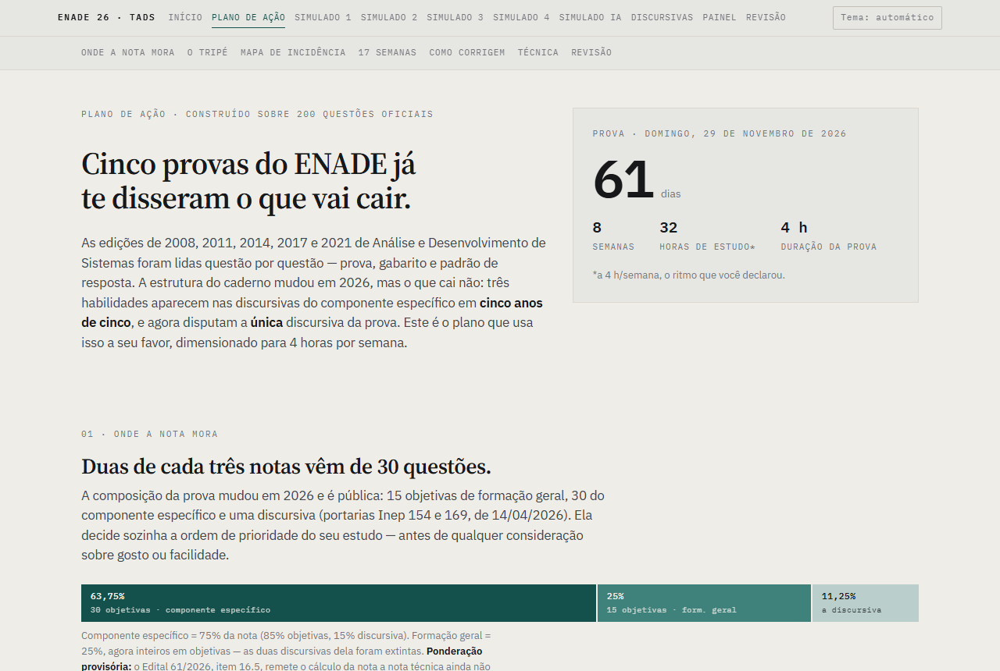
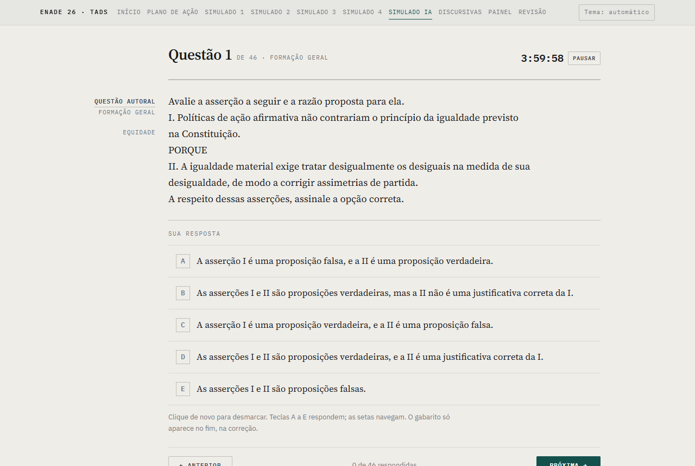
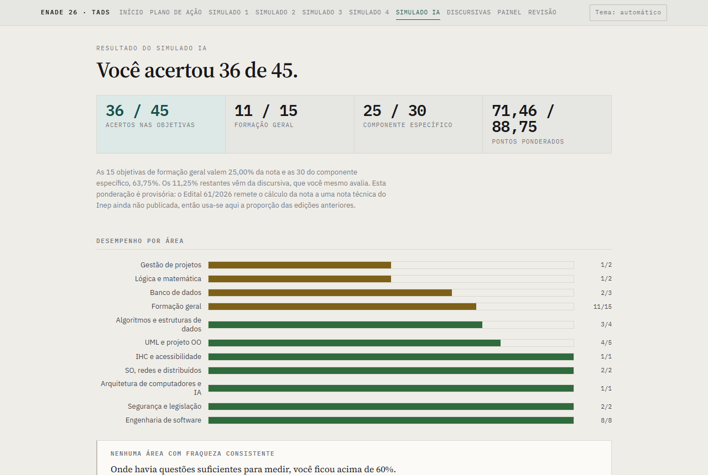
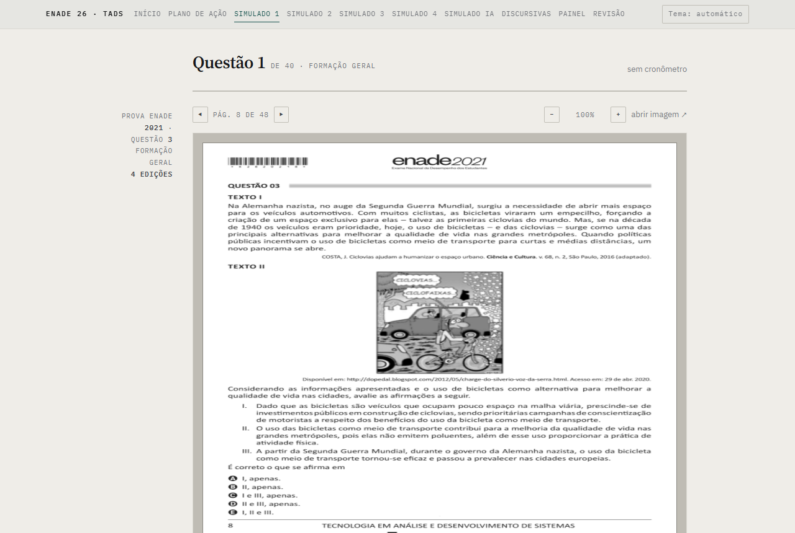
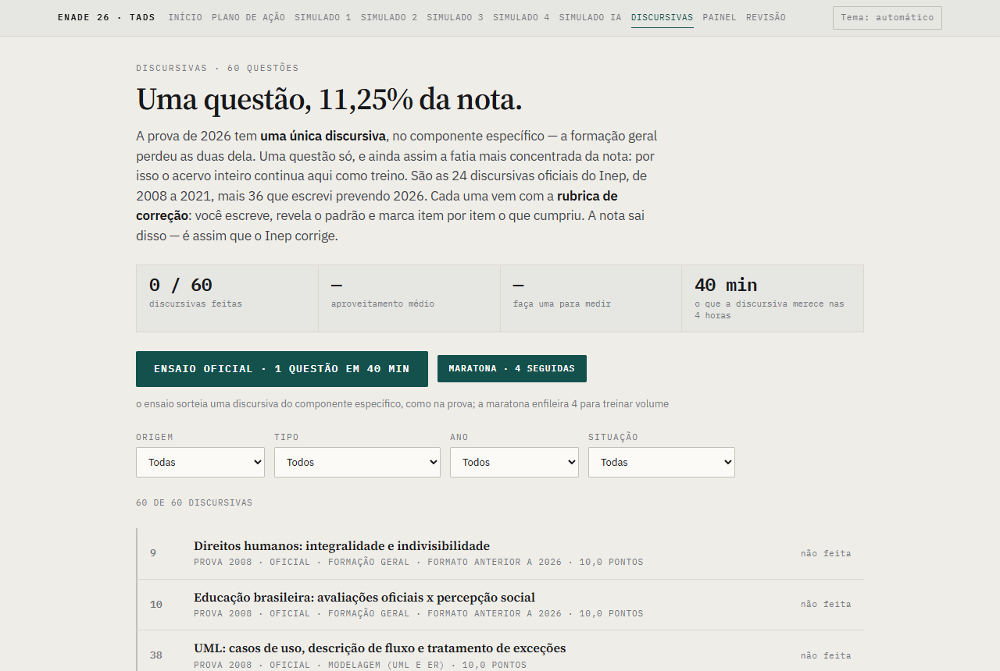
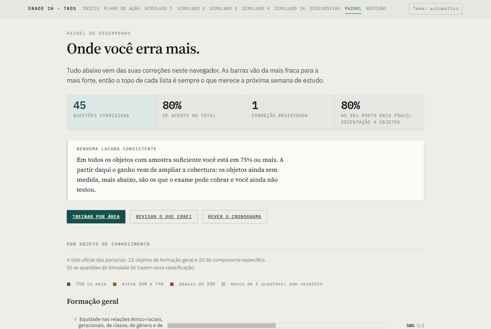
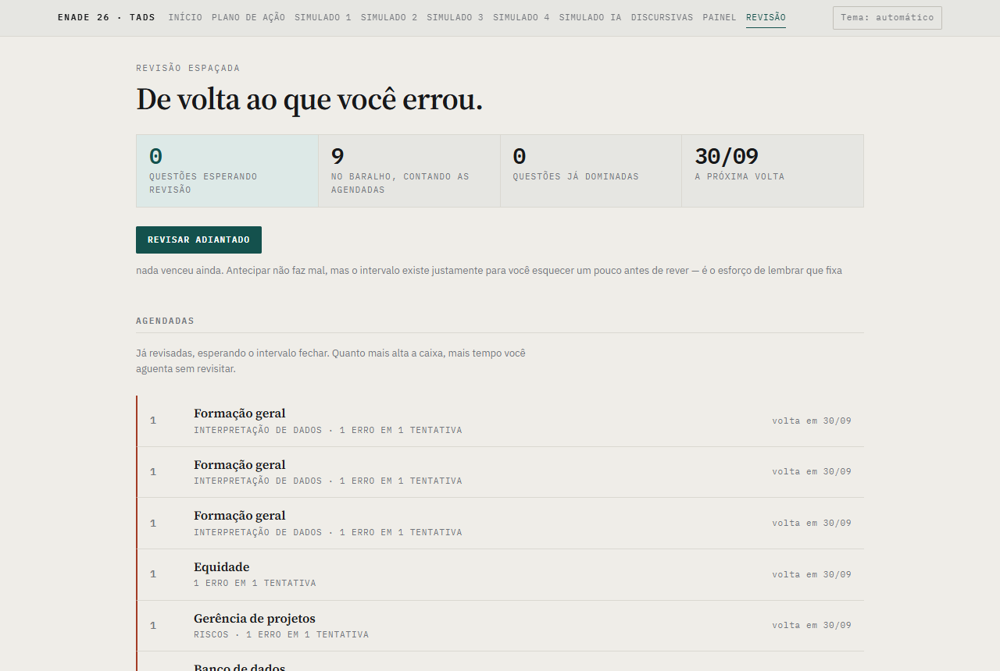
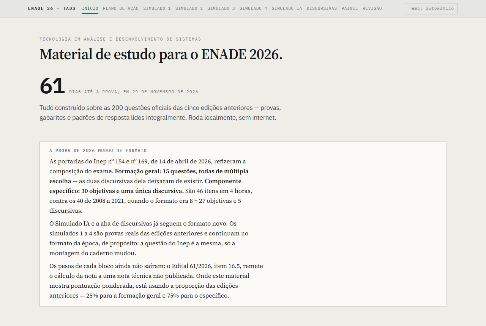

# ENADE 2026 TADS — material de estudo local para Análise e Desenvolvimento de Sistemas

Material gratuito e 100% local para estudar para o Exame Nacional de Desempenho dos Estudantes de 2026, área de
Tecnologia em Análise e Desenvolvimento de Sistemas, com foco em **o que o Inep de fato cobra**: as 200 questões
oficiais das cinco edições anteriores, lidas uma a uma, e um banco autoral calibrado sobre elas.

## Por que este projeto existe

O ENADE não publica um programa de estudo. Publica portarias com listas de "objetos de conhecimento" — vinte no
componente específico, doze na formação geral — e cadernos de provas antigas. Entre uma coisa e outra fica a
pergunta que decide como gastar as semanas até a prova: *o que cai, com que frequência e de que jeito?*

Responder a isso exige ler as provas de 2008, 2011, 2014, 2017 e 2021, com gabaritos e padrões de resposta,
classificar cada questão e contar. E a prova de 2026 mudou de formato — 45 objetivas e uma discursiva, contra as
40 questões de antes —, então o acervo sozinho não basta para ensaiar. Este material:

- reúne o acervo oficial do Inep, com a procedência de cada arquivo;
- classifica as 200 questões por área, tema, habilidade cobrada e formato, e mostra a incidência;
- oferece **644 objetivas e 36 discursivas autorais** no formato de 2026, sorteadas na proporção que o acervo
  mede, e **medidas contra o chute**: uma questão resolvível sem saber a matéria não treina ninguém;
- mede o desempenho **por objeto de conhecimento oficial**, na linguagem em que o Inep descreve a prova;
- devolve as questões erradas em revisão espaçada, até que deixem de ser erradas.

Aplicação em **29 de novembro de 2026**, domingo, com quatro horas de duração.

## Principais funcionalidades

- **Plano de ação**: incidência do acervo por área e habilidade, mapa filtrável das 200 questões, gestão do tempo
  de prova e cronograma semanal com checklist.
- **Simulados 1 a 4** com as questões reais do Inep, exibidas como imagem da página original do caderno.
- **Simulado IA**: uma prova nova a cada clique, no formato de 2026 (15 + 30 + 1), com cota por área e por
  habilidade, alternativas embaralhadas e preferência pelo que você ainda não viu. Ou treino de uma área só.
- **Correção comentada**: toda explicação diz por que o gabarito está certo **e** por que os distratores estão
  errados; pontuação ponderada e diagnóstico por área ao final.
- **Discursivas**: 24 oficiais e 36 autorais, com 296 itens de rubrica, ensaio cronometrado de 40 minutos e
  conferência de expressão (item 3.9.1 do edital).
- **Painel**: desempenho por objeto oficial, por área, por habilidade cobrada, por semana e por origem da questão.
- **Revisão espaçada** das questões erradas, em caixas de Leitner.
- **Tema claro e escuro**, sem internet, sem cadastro e sem servidor de aplicação.
- **Auditoria reproduzível**: toda afirmação numérica deste README sobre o banco é recalculada por
  `node ferramentas/auditar.js`.

## Princípios

- **O oficial prevalece.** As questões autorais são previsões, não itens do Inep, e dizem isso em toda tela onde
  aparecem. Onde houver divergência, valem `provas/`, `gabaritos_oficiais/` e `padroes_resposta/`.
- **A régua vem do acervo, não de opinião.** A cota do sorteio, o mix de habilidade e o alvo de questões com
  gráfico ou tabela são medidos em `questoes_mapeadas.csv`. Corrigir uma linha do CSV reacomoda o alvo.
- **Nenhum número por afirmação.** O que o material diz sobre si mesmo — acerto no chute, cobertura dos objetos,
  discussão dos distratores — sai de uma ferramenta que qualquer um roda, e que falha se a meta cair.
- **Premissa provisória sinalizada.** O peso oficial de 2026 não foi publicado; onde há pontuação ponderada, a
  proporção histórica está isolada numa constante e marcada como provisória na tela.
- **Sem diagnóstico com amostra pequena.** O painel não dá veredito com menos de cinco questões; zero em três é
  ruído com aparência de diagnóstico.
- **Privacidade**: tudo roda no navegador de quem estuda. Nada é transmitido.

## Tecnologias

- **Interface**: HTML, CSS e JavaScript puros, sem frameworks, bibliotecas externas ou etapa de compilação.
- **Tipografia** auto-hospedada em `estudo/assets/fontes/` (Source Serif 4, IBM Plex Mono e IBM Plex Sans, woff2
  sob licença OFL, 204 KB): o material continua funcionando sem internet.
- **Gráficos, tabelas e diagramas** das questões desenhados em SVG por um renderizador próprio
  (`estudo/assets/artefato.js`), com descrição textual para leitor de tela e paleta que passa em teste de
  daltonismo nos dois temas.
- **Ferramentas de auditoria e teste**: Node.js, sem dependências.
- **Servidor local opcional**: `python -m http.server`, só para contornar navegadores que bloqueiam
  `localStorage` em `file://`.

## Telas

| | |
|---|---|
|  |  |
| **Plano de ação** — onde a nota mora, incidência do acervo e cronograma. | **Simulado IA** — prova nova a cada clique, no formato de 2026. |
|  |  |
| **Resultado** — acertos, pontuação ponderada provisória e desempenho por área. | **Simulados 1 a 4** — a questão do Inep na página original do caderno. |
|  |  |
| **Discursivas** — acervo oficial e autoral, ensaio de 40 minutos e rubrica. | **Painel** — onde você erra mais, por objeto oficial, área e habilidade. |
|  |  |
| **Revisão** — o baralho de Leitner com as questões erradas e a próxima volta. | **Início** — contagem regressiva e o que mudou na prova de 2026. |

Capturas de 29/09/2026, no tema claro. O resultado, o painel e a revisão vêm de um Simulado IA respondido
automaticamente para a ilustração, e não de desempenho real.

## Início rápido

Não há instalação. Clone o repositório e abra `estudo/index.html` por duplo clique.

Alguns navegadores bloqueiam o armazenamento local em páginas abertas direto do disco, e aí as marcações não
sobrevivem ao fechamento da página. Nesse caso use `estudo/abrir.cmd`, que serve a pasta em
`http://localhost:8000` e abre o navegador na página inicial (requer Python). Equivale a:

```
cd estudo
python -m http.server 8000
```

Para conferir os números do banco e rodar os testes (requer Node.js):

```
node ferramentas/auditar.js                     # as 26 metas de qualidade do banco
node ferramentas/testar-artefatos.js            # o renderizador de gráficos, tabelas e diagramas
node ferramentas/testar-artefatos-do-banco.js   # os 65 artefatos que estão de fato no banco
node ferramentas/testar-migracao.js             # a migração do histórico v1 → v2 não apaga progresso
```

## A prova de 2026

A estrutura do exame mudou nesta edição. As provas de 2008 a 2021 tinham 40 questões — oito objetivas e duas
discursivas de Formação Geral, mais 27 objetivas e três discursivas do componente específico. Em 2026:

| Componente | Objetivas | Discursivas |
|---|---|---|
| Formação Geral | 15 | — |
| Componente específico de TADS | 30 | 1 |
| **Total** | **45** | **1** |

| Documento | Objeto |
|---|---|
| Portaria Inep nº 154, de 14/04/2026 | Diretrizes do componente de Formação Geral. Fixa as 15 questões de múltipla escolha e lista doze objetos de conhecimento. |
| Portaria Inep nº 169, de 14/04/2026 | Diretrizes do componente específico de TADS. Fixa 30 objetivas e uma discursiva, duas competências e vinte objetos de conhecimento. |
| Edital Inep nº 61, de 15/05/2026 | Confirma a composição e a duração. O item 3.8 determina que os itens de Formação Geral sigam os princípios dos Direitos Humanos. O item 3.9.1 acrescenta à correção da discursiva clareza, coerência, coesão, estratégias argumentativas e vocabulário. |

O item 16.5 do edital remete o cálculo da nota a nota técnica ainda não publicada. **Não existe, portanto, peso
oficial divulgado para 2026.** Onde este material exibe pontuação ponderada, aplica a proporção histórica — 25%
para a Formação Geral e 75% para o componente específico, este subdividido em 85% de objetivas e 15% de
discursiva. A premissa está isolada numa única constante (`PESOS`, em `estudo/assets/simulado.js`) e sinalizada
como provisória em toda tela que a utiliza.

## Páginas

Em `estudo/`, onze páginas independentes que compartilham estado local:

| Arquivo | O que faz |
|---|---|
| `index.html` | **Porta de entrada**: contagem regressiva e resumo do que mudou no formato de 2026. |
| `plano.html` | **Plano de ação**: onde a nota mora, incidência do acervo por área e habilidade, mapa filtrável das 200 questões, gestão do tempo de prova, cronograma semanal com checklist, como o Inep corrige e técnica de prova. |
| `simulado-01.html` a `simulado-04.html` | **Simulados oficiais**: quatro provas montadas com questões reais do Inep, exibidas como imagem da página original do caderno, com zoom e navegação entre páginas. |
| `simulado-ia.html` | **Simulado IA**: prova gerada a cada clique a partir do banco autoral, no formato de 2026, ou treino restrito a uma área e quantidade. Mostra a cobertura do banco já vista. |
| `discursivas.html` | **Discursivas**: acervo filtrável por origem, tipo, ano e situação; autocorreção por rubrica; ensaio oficial (uma questão em 40 minutos) e maratona (quatro seguidas). |
| `painel.html` | **Painel**: desempenho por objeto de conhecimento oficial, por área, por habilidade cobrada, por semana e por origem (autoral × Inep). |
| `revisao.html` | **Revisão espaçada**: as questões erradas voltando em intervalos crescentes. |
| `amostra-design.html` | Referência do sistema de design, não é tela de estudo: os dois registros lado a lado, a lei da cor e a mesa de luz. |

### Simulados com questões oficiais

Os simulados 1 a 4 reproduzem a montagem vigente até 2021 e **não foram reestruturados para o formato de 2026**.
A decisão é deliberada: a questão do Inep é a que caiu, e adaptá-la ao novo caderno destruiria o valor de treinar
com o item original. Cada um exibe tarja explicando a diferença de formato e remetendo ao Simulado IA para ensaiar
a composição atual.

### Banco autoral

644 questões objetivas e 36 discursivas escritas como previsão para 2026, distribuídas por onze áreas:

| Área | Questões | Área | Questões |
|---|---|---|---|
| Formação geral | 156 | Banco de dados | 40 |
| Engenharia de software | 107 | SO, redes e distribuídos | 40 |
| UML e projeto orientado a objetos | 74 | Segurança e legislação | 36 |
| Algoritmos e estruturas de dados | 60 | Arquitetura de computadores | 28 |
| Gestão de projetos | 41 | IHC e acessibilidade | 25 |
| Lógica e matemática | 37 | | |

A cota de sorteio do componente específico — oito questões de engenharia de software, cinco de orientação a
objetos, quatro de algoritmos, e assim por diante — reproduz a incidência histórica medida no acervo, com três
desvios que as portarias justificam: segurança sobe de uma para duas questões, porque a Portaria 169 nomeia
"segurança cibernética" e "legislação, normas, ética e responsabilidade socioambiental" como objetos distintos;
algoritmos e banco de dados sobem uma questão cada, porque "estruturas de dados" passa a ser objeto próprio.

Além da área, o sorteio respeita uma cota por **habilidade cobrada** — conceito puro, julgamento de itens,
interpretação de artefato, cálculo ou traço, asserção-razão, estudo de caso —, medida nas 175 objetivas oficiais.
65 questões trazem gráfico, tabela ou diagrama, e a prova sorteada chega a 48,5% de itens com artefato, contra
55% no acervo.

### Discursivas

24 discursivas oficiais do Inep e 36 autorais, com 296 itens de rubrica no total. Onde o padrão oficial declara o
valor de cada item, a rubrica usa esse valor; onde apenas enumera o que se espera, a divisão dos pontos é
interpretativa e está sinalizada na questão.

O ensaio cronometrado reproduz a prova de 2026 — uma discursiva em 40 minutos. A maratona enfileira quatro
questões, sem correspondência com o exame, para acumular repertório. As discursivas de Formação Geral permanecem
no acervo como treino de escrita, marcadas como formato anterior a 2026.

Cada questão traz ainda uma conferência de expressão — clareza, coerência, coesão, argumentação e vocabulário —,
derivada do item 3.9.1 do edital. Ela não pontua: as rubricas são as do Inep, com os pontos que ele de fato
distribuiu, e acrescentar pontos de linguagem falsearia o padrão oficial.

## Metodologia

### Classificação por objeto de conhecimento

As onze áreas do material são uma classificação própria, construída por recorrência. Sobre elas foi mapeada a
nomenclatura oficial: os doze objetos de Formação Geral da Portaria 154 e os vinte do componente específico da
Portaria 169, num total de 32. O mapeamento `(área, subtema) → objeto oficial` está em `estudo/assets/objetos.js`
e permite auditar cobertura e reportar desempenho na linguagem em que o Inep descreve a prova.

Nenhum dos 32 objetos tem menos de dez questões no banco. Duas classificações do material ficam fora do rol
oficial e estão registradas como divergência: "interpretação de dados", que descreve o formato do item e não um
tema, e "inteligência artificial", que não consta em nenhuma das duas portarias.

### Calibração contra o chute

Um banco de questões mal escrito é resolvível sem conhecer a matéria. Três vícios foram medidos e mantidos sob
meta:

**Chutar pelo tamanho.** Quando a alternativa correta é sistematicamente a mais longa, quem chuta a maior acerta
muito acima do acaso. A medida considera apenas a diferença perceptível — margem de quinze caracteres sobre a
segunda colocada —, porque diferença de quatro caracteres não é pista para ninguém. Resultado atual: 7,1% de
acerto chutando a visivelmente mais longa e 3,6% chutando a mais curta, contra 20% de acaso. A posição da correta
na fonte também é equilibrada (A 132 · B 131 · C 131 · D 125 · E 125), e as alternativas são embaralhadas a cada
sorteio.

**Resolver por eliminação.** Quando três ou mais alternativas são absurdos descartáveis ("nunca erram", "garante
ausência de defeitos"), a questão vira escolha entre duas. Resultado atual: zero questões. A medida distingue
marcador de absurdo de quantificador de escopo — "todos os titulares", "qualquer tratamento" são linguagem
precisa, e um bom distrator frequentemente descreve com exatidão a coisa errada.

**Explicação que justifica sem refutar.** A explicação que só demonstra por que o gabarito está certo não diz ao
estudante por que a alternativa que ele marcou está errada — e é essa a informação que ele foi buscar. A medida
pergunta se a explicação fala do que cada distrator afirma: cada um tem vocabulário próprio, termos que estão
nele e não estão na correta nem no enunciado, e quem escreve sobre aquele distrator acaba usando algum deles.
Onde a alternativa é um valor — "13 dias.", "56%." — o distrator é o número, e citá-lo conta como discuti-lo; em
julgamento de itens e asserção-razão, cujas alternativas são rótulos fixos, o que se exige é nomear a afirmativa
falsa. Exige-se discutir ao menos dois dos quatro distratores. Resultado atual: 99,2%. Cinco questões em 644
ficam fora do alcance da régua, porque seus distratores são valores pequenos que o próprio enunciado usa.

Nas discursivas, a hipótese equivalente seria a rubrica com itens não falsificáveis, do tipo "demonstra
compreensão do conceito", que se pode marcar como cumprido independentemente do que se escreveu. A auditoria dos
296 itens encontrou zero: onde aparece verbo vago, ele vem sempre seguido do que exatamente conferir. O vício ali
não estava na redação das rubricas, e sim no fluxo — ver a seção seguinte.

### Integridade da autocorreção

A correção das discursivas é feita pelo próprio estudante contra a rubrica. Abrir o padrão de resposta antes de
escrever anula o exercício, e a nota obtida assim corromperia a medida que a aba existe para produzir.

O material admite responder no papel e admite ler o padrão para estudar. A trava, portanto, não bloqueia: torna a
escolha explícita e registrada. Com resposta escrita, a revelação é um clique. Com o editor vazio, o sistema
pergunta se a resposta foi feita no papel ou se é apenas leitura; no segundo caso a tentativa é gravada como
**leitura**, aparece rotulada no histórico e fica fora de toda média.

## Registro de desempenho

O sistema grava, a cada correção, uma linha por questão, com área, objeto de conhecimento oficial, habilidade,
acerto e data. Sobre esse registro operam o painel e a revisão espaçada.

O painel reporta por objeto oficial e por área, ordenando do pior para o melhor. Nada é diagnosticado com menos
de cinco questões, e o que não tem amostra suficiente vai para o fim da lista, não para o topo. O percentual e a
fração aparecem em toda linha, de modo que a informação nunca depende apenas da cor. Três gráficos completam a
leitura: acerto por habilidade cobrada, questões corrigidas por semana e acerto por origem — este último serve
também para calibrar o próprio material: se o banco autoral fica muito acima das provas do Inep, as questões
autorais estão fáceis demais.

A revisão espaçada aplica caixas de Leitner. Uma questão errada entra no baralho e retorna no dia seguinte; a
cada acerto o intervalo cresce — 1, 3, 7 e 16 dias — e quatro acertos seguidos a retiram do baralho. Um erro
devolve a questão à primeira caixa. O baralho não tem estado próprio: é derivado do histórico a cada abertura,
o que evita duas versões da mesma verdade.

A revisão cobre o banco autoral, cujas questões o histórico identifica individualmente por id estável. As
objetivas dos simulados 1 a 4 são imagens de página de caderno, sem identificador individual; o sistema informa
quantas foram erradas e remete ao simulado correspondente.

### Armazenamento

Tudo reside no `localStorage` do navegador, sob o prefixo `enade26.`:

| Chave | Conteúdo |
|---|---|
| `enade26.historico` | série consolidada de desempenho, base do painel e da revisão |
| `enade26.simulado1.v2` … `simulado4.v2` | respostas de cada simulado oficial |
| `enade26.ia.prova`, `enade26.ia.respostas`, `enade26.ia.vistas` | prova gerada, respostas e estoque já sorteado |
| `enade26.revisao.sessao`, `enade26.revisao.respostas` | sessão de revisão em andamento |
| `enade26.discursivas` | textos escritos, marcações de rubrica e notas |
| `enade26.progresso` | checklist do cronograma |
| `enade26.tema` | preferência de tema claro ou escuro |

Nada é transmitido. Copiar a pasta para outra máquina leva o material, não o progresso.

## Testes e auditoria

- `ferramentas/auditar.js` — recalcula, a partir dos arquivos do repositório, toda afirmação numérica que este
  README faz sobre o banco: chute pelo tamanho, eliminação por absurdo, distribuição da correta, discussão dos
  distratores, cota por área e por habilidade em 200 provas sorteadas, cobertura dos 32 objetos oficiais,
  duplicatas, ids estáveis, rubricas não falsificáveis e scripts ausentes nas páginas. `--json` devolve o mesmo
  em JSON. Sai com código 1 se alguma meta falhar, para servir de porteiro em CI ou hook.
- `ferramentas/testar-artefatos.js` — o renderizador: cor fixa que some no tema escuro, gráfico sem descrição
  textual, eixo em escala quebrada, marcação malformada.
- `ferramentas/testar-artefatos-do-banco.js` — os artefatos que estão no banco: montam, SVG bem formado e com
  descrição, nenhum elemento ou classe que o navegador descarte em silêncio, tabelas e séries consistentes.
- `ferramentas/testar-migracao.js` — a troca do índice pela identidade estável da questão não apaga o histórico
  nem o baralho de revisão de quem já estudava.

Além dessas, o sistema passou por uma bateria de 215 asserções sobre DOM real — composição e cota do sorteio,
pontuação ponta a ponta pela interface, agregação do painel, caixas de revisão, rotas de navegação, carga das
páginas sem erro de console e uma jornada completa a partir do estado vazio. Esse arnês não é distribuído com o
pacote.

Última rodada (29/09/2026): as 26 metas da auditoria dentro do alvo; 27 verificações do renderizador, 65
artefatos do banco (50 tabelas, 12 gráficos, 3 diagramas) e 27 verificações de migração, todas passando.

## Acessibilidade e design

Dois registros que não se misturam: **leitura** — enunciado, alternativas, explicação, rubrica — em Source Serif
4, papel morno e nenhuma cor; **instrumento** — navegação, cronômetro, mapa, placar, filtros, tabelas — em IBM
Plex Mono denso, e só ali existe cor. A lei da cor vale para o CSS inteiro: acento marca o que se clica, cor de
estado marca o que aconteceu, e todo o resto é cinza.

A digitalização dos cadernos não é invertida no tema escuro: o papel fica no branco verdadeiro sobre um fosco
que escurece com o tema, como um documento numa mesa de luz. Tema claro, escuro ou automático; teclas A a E
respondem e as setas navegam; gráficos com descrição para leitor de tela e paleta categórica validada sob
daltonismo; informação de desempenho sempre também em número, nunca só em cor.

## Limitações conhecidas

- **As questões autorais não são do Inep.** Foram escritas como previsão a partir dos padrões identificados no
  acervo. Gabaritos e explicações são interpretativos e podem conter erro.
- **Os pesos são provisórios.** Enquanto a nota técnica prevista no item 16.5 do edital não for publicada, a
  pontuação ponderada exibida é extrapolação da regra histórica.
- **O mix de habilidade do banco ainda não é o do acervo.** O banco tem mais conceito puro do que o Inep cobra; o
  sorteio compensa escolhendo por habilidade, e a tela avisa quando uma célula não tem estoque.
- **A classificação por área e habilidade é interpretativa.** Gabaritos e questões anuladas são oficiais; o
  agrupamento temático serve para priorizar o estudo e não tem estatuto normativo.
- **A correção das discursivas é do próprio estudante.** Nenhum sistema corrige texto livre com segurança. O que
  o material faz é fornecer a régua oficial e obrigar a conferência item a item.
- **Simulados oficiais não entram na revisão espaçada**, porque são imagens de página sem identificador por
  questão.
- **O progresso fica no navegador.** Limpar os dados do site apaga o histórico, e não há exportação.

## Fontes

Todas públicas e oficiais. O projeto é independente e não tem vínculo com o Inep.

- **Inep — Provas e Gabaritos do ENADE**: cadernos de prova, gabaritos oficiais e padrões de resposta das edições
  de 2008, 2011, 2014, 2017 e 2021 de TADS. `manifesto_enade_tads.csv` registra a URL de origem de cada arquivo.
- **Portarias Inep nº 154 e nº 169**, de 14 de abril de 2026, e **Edital Inep nº 61**, de 15 de maio de 2026: a
  estrutura da prova de 2026 e os objetos de conhecimento.

Acervo: 200 questões, sendo 175 objetivas e 25 discursivas, das quais cinco anuladas. As páginas dos cadernos e
dos padrões de resposta foram extraídas em imagem (168 e 31 arquivos) para exibição junto às questões.

## Estrutura

```
README.md · LICENSE (MIT) · manifesto_enade_tads.csv · questoes_mapeadas.csv (as 200 questões classificadas uma a uma)
provas/ · gabaritos_oficiais/ · padroes_resposta/     PDFs oficiais do Inep
docs/img/     capturas de tela usadas no README
estudo/       index.html · plano.html · simulado-01..04.html · simulado-ia.html · discursivas.html
              painel.html · revisao.html · amostra-design.html · abrir.cmd
  assets/     simulado.js (PESOS) · sorteio.js · historico.js · painel.js · revisao.js · discursivas.js
              objetos.js (área → objeto oficial) · acervo.js · artefato.js · nav.js · paginas.js
              base-v2.css · simulado-v2.css · plano-v2.css · amostra.css · fontes/
  assets/banco/  es · oo · al · bd · gp · in · ml · ih · sg · ot · fg (objetivas por área)
                 disc.js · disc-oficiais.js · legado-ids.js (tabela congelada de migração)
  paginas/    168 páginas dos cadernos, em imagem
  padroes/    31 páginas dos padrões de resposta, em imagem
ferramentas/  auditar.js · testar-artefatos.js · testar-artefatos-do-banco.js · testar-migracao.js
```

## Licença

Código, questões autorais e rubricas distribuídos sob a licença MIT (veja `LICENSE`). Os cadernos de prova,
gabaritos e padrões de resposta em `provas/`, `gabaritos_oficiais/`, `padroes_resposta/`, `estudo/paginas/` e
`estudo/padroes/` são do Inep e não estão cobertos por ela. As fontes em `estudo/assets/fontes/` seguem a licença
OFL, descrita em `LICENCA.txt`.
